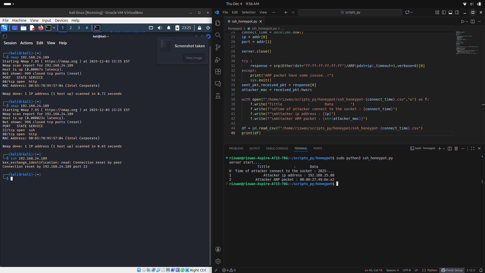

# Simple SSH Honeypot

## What is a Honeypot?
A **honeypot** is a fake or decoy system created to attract attackers. It tricks them into interacting with it so you can monitor, detect, and study their behavior without risking your real systems.


This project is a **Python-based SSH honeypot** designed to detect attackers inside a network. It listens on a fake SSH port, captures incoming connection attempts, identifies the attacker's IP, sends an ARP request using Scapy, retrieves the MAC address, and generates a clean report using Pandas.

## ✨ Key Features
- **Python-based lightweight honeypot**
- Uses `socket` to create a fake SSH service
- Uses `scapy` to send ARP requests and fetch MAC addresses
- Uses `pandas` to generate detailed attack logs
- Captures attacker IP + MAC when they scan or connect to the fake SSH port
- Customizable SSH port (example: change port to **2222** or any unused port)

---

## 📦 Installation

Clone the repository:
```bash
git clone https://github.com/MuhammedRizwanpr/simple_ssh_honeypot.git
cd simple_ssh_honeypot
```

Install dependencies:
```bash
pip install scapy pandas
```

(Scapy may require root privileges depending on the OS.)

---

## ⚙️ Configuration

### **Change the SSH Honeypot Port**
By default, SSH uses port **22**, but for safety and to avoid conflicts, change the script to use a different unused port:

Example:
```python
PORT = 2222
```

You can set this to any free port.

---

## ▶️ Running the Script
Run the honeypot with:
```bash
sudo python3 honeypot.py
```

You must run as root because Scapy requires elevated privileges for ARP operations.

---

## 📊 Output
The script generates a detailed Pandas-based report containing:
- Attacker IP
- Attacker MAC
- Timestamp

Output is saved in the reports folder or printed on screen depending on your script settings.

---

## 🖼️ Screenshot
(REAL EXAMPLE OF HONEYPOT)


---

## 📚 Libraries Used
- **socket** → Fake SSH listener
- **scapy** → ARP request + MAC resolution
- **pandas** → Generating the attack report
- **datetime** → Timestamp logging

---

## 🛡️ Purpose
This honeypot helps detect unauthorized port scans or login attempts **inside your local network** by identifying attackers at both IP and MAC level.

---

## ✔️ Status
Fully working prototype. Suitable for learning network security, attacker behavior, and basic honeypot concepts.

---

## 👤 Author
**Muhammed Rizwan**

